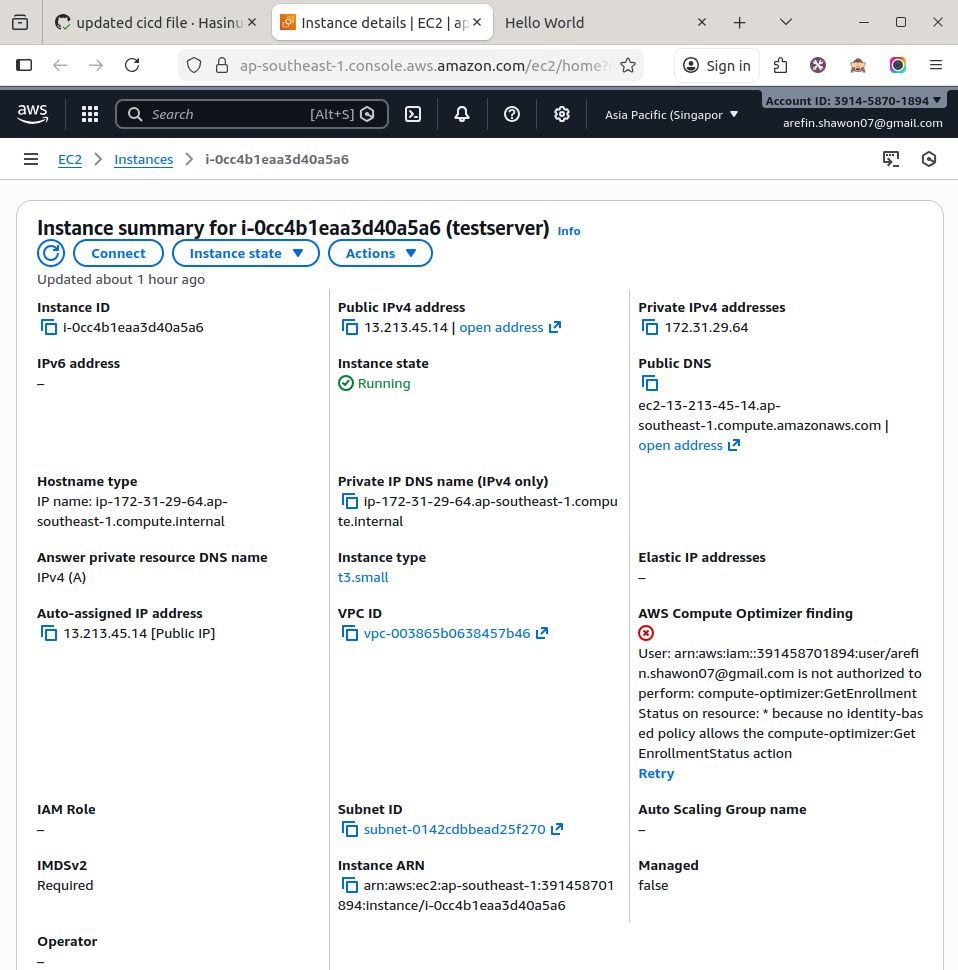
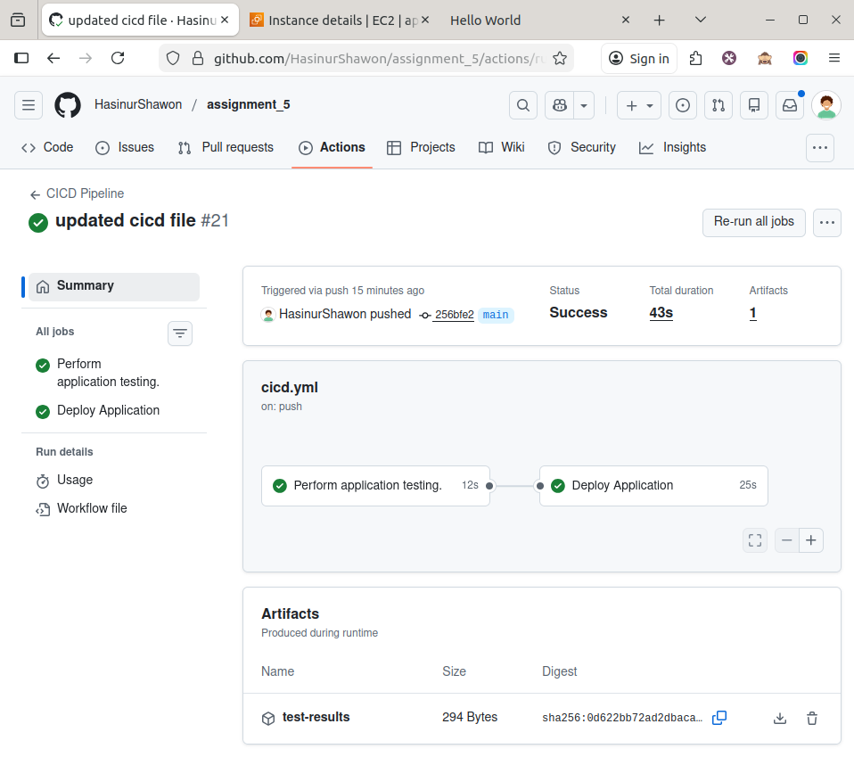
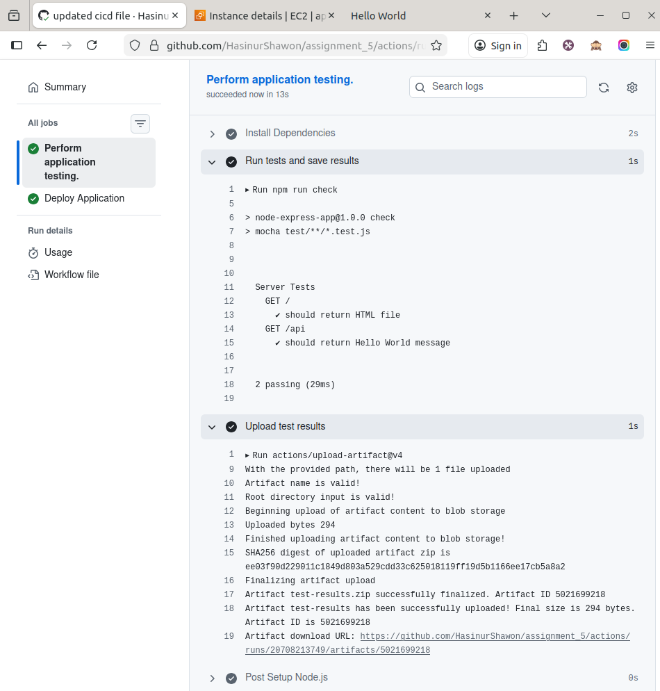
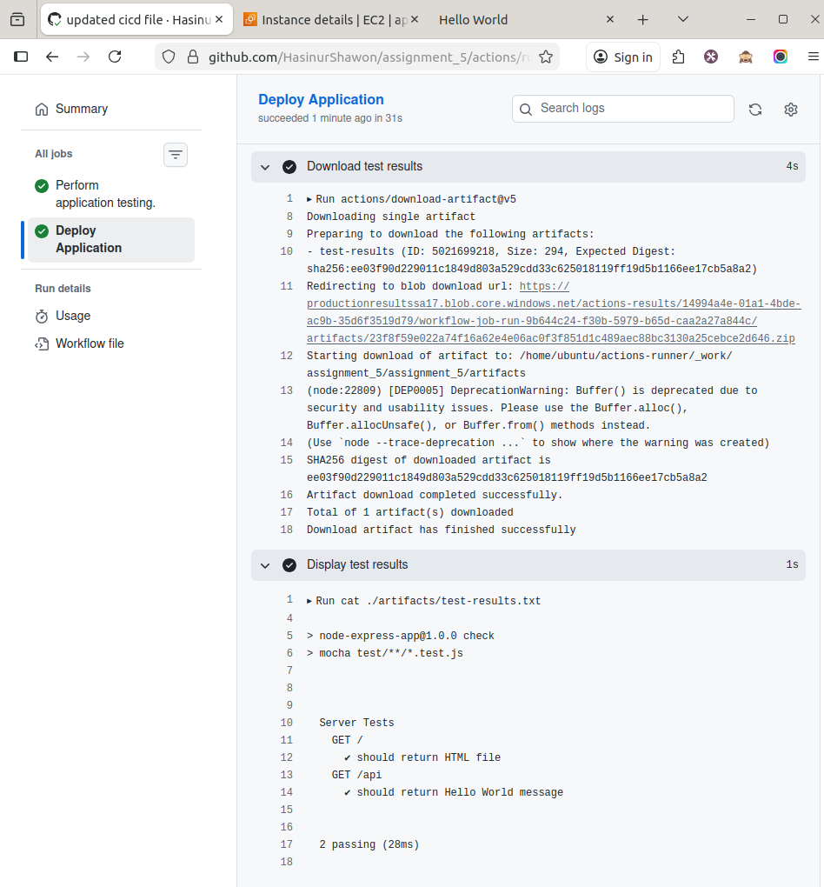
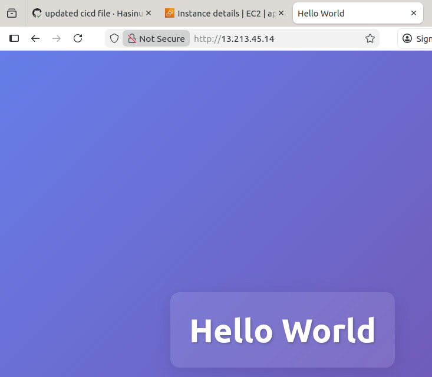

[](https://github.com/HasinurShawon/assignment_5/actions/workflows/cicd.yml)

## Assignment 5
Working repository: https://github.com/HasinurShawon/assignment_5.git

#### EC2 Summary


#### CI/CD job actions success and artifacts file. Evidence of successful workflow execution


#### _Test Job Result_: Executes application tests, saves the test output to a file, and uploads the results as a build artifact.

```
> node-express-app@1.0.0 check
> mocha test/**/*.test.js
  Server Tests
    GET /
      ✔ should return HTML file
    GET /api
      ✔ should return Hello World message
  2 passing (43ms)
```


#### _Deploy Job_: Runs after successful test job, downloads and displays the test results artifact, then deploys the Node.js application to a configured self-hosted runner.


#### Successful application deployment.


#### A description of challenges encountered and solutions.
**_1. Functional Application Deployment:_**

The Node.js application was successfully deployed using a GitHub Actions CI/CD pipeline and a self-hosted runner.
* The deploy job runs only after the test job completes successfully
* The application is managed by PM2 and the service runs on port 3000.
* Nginx is configured as a reverse proxy to forward incoming HTTP requests from port 80 to the Node.js application.

This confirms that the application is fully functional and automatically deployed through the CI/CD pipeline.


**_2. Challenges Encountered and Solutions:_**

* ##### Challenge 1: PM2 Not Found on Self-Hosted Runner

    The deployment job failed initially because PM2 was not available on the self-hosted runner, even though it was used in the GitHub Actions workflow.

    ##### Solution:
    Node.js and PM2 were installed manually on the server as a one-time setup. This ensured that the CI/CD pipeline could manage the application process without reinstalling system dependencies on every run.

* ##### Challenge 2: 502 Bad Gateway Error from Nginx:
    
    After configuring Nginx, accessing the application returned a 502 Bad Gateway error.

    ##### Solution:
    
    The issue was identified as the Node.js application not running and not listening on port 3000. After starting the application with PM2 and confirming the port was active, the Nginx reverse proxy worked correctly.
